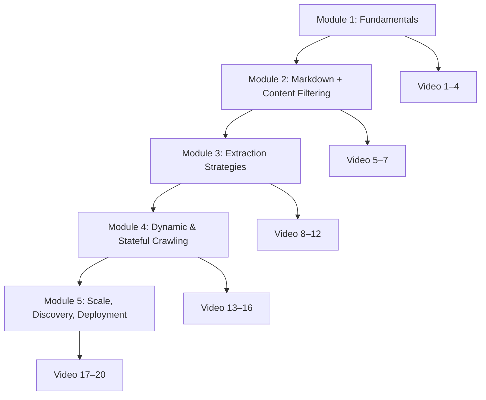

# Crawl4AI YouTube Tutorial Series Outline

## Executive Summary

Crawl4AI is an asynchronous, browser-backed web crawler/scraper designed to turn web pages into AI-ready artifacts (clean Markdown, structured JSON, screenshots/PDFs) while offering “power user” controls such as sessions, hooks, proxies, stealth/undetected browsing, and high-concurrency multi-URL crawling. citeturn10search4turn10search6turn12search13turn23view1turn19view0

The instructional through-line for a _coding-focused_ video series is a single mental model: **a crawl is `AsyncWebCrawler.arun(url, config=CrawlerRunConfig(...))` returning a `CrawlResult`; everything else is configuration and post-processing**—including Markdown generation (raw vs “fit”), extraction strategies (CSS/XPath/regex/LLM), and scale (deep crawling, URL seeding, `arun_many()` dispatchers). citeturn10search6turn12search13turn23view1turn20view2turn21view2turn10search1

This curriculum is intentionally **no-installation-video** and assumes Crawl4AI is already usable in your environment. The series is structured as five modules (beginner → advanced) with **20 short videos (≤10 minutes each)**, each ending with an immediately runnable script. Core design choices reflect the docs’ emphasis that **pattern-based extraction (schema/regex) is usually preferable to LLM extraction for speed/cost/repeatability**, with **LLM usage concentrated in one-time “schema/pattern generation” or genuinely unstructured tasks**. citeturn13view0turn12search12turn13view2

## Crawl4AI Technical Overview

Crawl4AI’s API surface in the docs centers on four concepts:

**Crawler + configs**

- `AsyncWebCrawler` runs crawls asynchronously and returns results. citeturn10search6turn12search13
- `BrowserConfig` sets browser-wide behavior (engine, headless, proxy, managed browser/CDP, etc.). citeturn11search6turn7search8
- `CrawlerRunConfig` sets per-crawl behavior (cache mode, extraction strategy, Markdown generator, JS execution, sessions, screenshots/PDFs, anti-bot options, etc.). citeturn11search6turn23view1turn19view1
- `CacheMode` is the unified caching control introduced in the “new approach” (replacing older boolean flags). citeturn23view0

**Outputs**

- A crawl returns `CrawlResult`, which can include raw/cleaned/fit HTML, Markdown variants (`raw_markdown`, `fit_markdown`, citations/refs), extracted JSON, links/media, downloads, screenshots/PDF bytes, and optional SSL certificate data. citeturn12search13turn7search15turn24search6turn18view0

**Extraction strategies (choose the cheapest that works)**

- Schema extraction: `JsonCssExtractionStrategy` (and XPath analogs) for consistent pages (fast, deterministic). citeturn14view1turn13view1
- Regex extraction: `RegexExtractionStrategy` with built-in entity patterns and custom regex; can also use a one-time LLM to generate a regex pattern for reuse. citeturn14view1turn15view0
- Semantic clustering: `CosineStrategy` selects relevant content blocks via similarity clustering, helpful when structure is inconsistent. citeturn13view3turn14view0
- LLM extraction: `LLMExtractionStrategy` for unstructured reasoning tasks (chunking, input formats, usage reporting). citeturn13view2turn14view1
- One-time schema generation: `generate_schema()` for `JsonCssExtractionStrategy` / `JsonXPathExtractionStrategy`, with optional schema validation and token usage tracking. citeturn13view0turn12search4turn12search3

**Crawling beyond a single page**

- Deep crawling (`BFSDeepCrawlStrategy`, `DFSDeepCrawlStrategy`, `BestFirstCrawlingStrategy`) supports depth limits, filters/scorers, and streaming vs non-streaming results. citeturn20view0turn20view3
- URL seeding (`AsyncUrlSeeder`, `SeedingConfig`) discovers many URLs quickly (e.g., via sitemaps), enabling “discover first, crawl second” pipelines. citeturn10search1turn24search4
- Multi-URL crawling: `arun_many()` uses dispatchers with rate limiting, memory-adaptive concurrency, and optional monitoring; can run in batch or streaming mode. citeturn21view0turn21view2
- Adaptive crawling (`AdaptiveCrawler.digest`) is query-guided and stops when sufficiency metrics reach a confidence threshold; supports resumption. citeturn22view0turn22view3turn22view2

## Curriculum Architecture and Visual Aids

This series is designed around two repeated workflows:

1. **Single page → clean Markdown / JSON / artifacts** (modules 1–4) citeturn23view1turn23view2turn13view1turn12search13
2. **Many pages → controlled concurrency + discovery strategy** (module 5) citeturn21view2turn20view3turn10search1

### Module progression diagram



This ordering reflects the docs’ structure: “Core” (single-page crawling, config, Markdown, cache) → “Extraction” (no-LLM first, then LLM) → “Advanced” (sessions, proxies, anti-bot, dispatchers, etc.). citeturn7search7turn23view1turn13view1turn21view0turn19view0

### Crawl data-flow diagram

```mermaid
flowchart LR
  U[Input: URL(s)] --> C[AsyncWebCrawler]
  BC[BrowserConfig] --> C
  RC[CrawlerRunConfig] --> C

  C --> H[HTML variants: html/cleaned_html/fit_html]
  C --> M[MarkdownGenerationResult: raw_markdown/fit_markdown/citations]
  C --> X[ExtractionStrategy output: extracted_content (JSON)]
  C --> L[Links & media]
  C --> A[Artifacts: screenshot/pdf/mhtml/downloaded_files/ssl_certificate]

  H --> M
  H --> X
```

This reflects documented config-object responsibilities, Markdown generation behavior, and `CrawlResult` fields. citeturn11search6turn23view1turn12search13turn12search15turn18view0turn24search6

## Series Overview Table

All runtimes are capped at 10 minutes by design; “code lines” estimates refer to the per-video primary script (excluding shared helpers in `common/`). Features and APIs referenced here are taken directly from the Crawl4AI docs (v0.8.x pages referenced throughout). citeturn10search4turn23view1turn20view0turn21view0turn22view0

| Module               | Title                                                              |  Skill level | Runtime | Code lines (est.) |
| -------------------- | ------------------------------------------------------------------ | -----------: | ------: | ----------------: |
| Fundamentals         | V1 Hello Crawl4AI: First `arun()` + Markdown                       |     Beginner |   7 min |                45 |
| Fundamentals         | V2 Config Objects 101: `BrowserConfig` vs `CrawlerRunConfig`       |     Beginner |   9 min |                70 |
| Fundamentals         | V3 Cache Modes: predictable caching with `CacheMode`               |     Beginner |   7 min |                60 |
| Fundamentals         | V4 CrawlResult Masterclass: fields, variants, artifacts            |     Beginner |  10 min |                90 |
| Markdown + Filtering | V5 Markdown Generation: `DefaultMarkdownGenerator` options         |     Beginner |   9 min |                70 |
| Markdown + Filtering | V6 Fit Markdown: Pruning vs BM25 filters                           | Intermediate |  10 min |                95 |
| Markdown + Filtering | V7 Links & Media: filtering images, counting links                 |     Beginner |   8 min |                60 |
| Extraction           | V8 CSS JSON extraction: `JsonCssExtractionStrategy`                | Intermediate |  10 min |               110 |
| Extraction           | V9 Schema power moves: nested lists, `source`, transforms          | Intermediate |  10 min |               140 |
| Extraction           | V10 Regex extraction: built-in patterns + custom regex             | Intermediate |   9 min |                95 |
| Extraction           | V11 One-time AI, infinite reuse: `generate_schema` + `TokenUsage`  | Intermediate |  10 min |               160 |
| Extraction           | V12 LLM extraction: `LLMExtractionStrategy` + chunking + usage     |     Advanced |  10 min |               150 |
| Dynamic & Stateful   | V13 Page interaction: `js_code` + `wait_for` patterns              | Intermediate |  10 min |               120 |
| Dynamic & Stateful   | V14 Session management: `session_id` reuse & cleanup               | Intermediate |  10 min |               130 |
| Dynamic & Stateful   | V15 C4A-Script DSL: `c4a_script` interactions                      | Intermediate |   9 min |               120 |
| Dynamic & Stateful   | V16 Virtual scroll: `VirtualScrollConfig` for replaced DOM         |     Advanced |  10 min |               110 |
| Scale & Discovery    | V17 Multi-URL crawling: `arun_many`, dispatchers, monitoring       |     Advanced |  10 min |               170 |
| Scale & Discovery    | V18 Deep crawling: BFS/DFS/BestFirst + filters + streaming         |     Advanced |  10 min |               180 |
| Scale & Discovery    | V19 URL seeding: `AsyncUrlSeeder` + `SeedingConfig` pipelines      |     Advanced |   9 min |               150 |
| Scale & Deployment   | V20 Production: proxies/rotation, anti-bot fallback, self-host API |     Advanced |  10 min |               190 |

## Detailed Module-by-Module Video Outlines

**Conventions for code snippets**

- Each snippet is **under 200 lines** and intended to live in a single `videos/` script file.
- Scripts assume you already have Crawl4AI working (no installation content).
- URL targets are intentionally safe placeholders (e.g., `example.com`) unless the docs strongly imply a public demo target.

### Module 1 — Fundamentals

**Video 1: Hello Crawl4AI: First `arun()` + Markdown**

- **Target audience/skill level:** Python beginners to intermediate devs new to Crawl4AI
- **Learning objectives (3–5):**
  - Run a minimal async crawl with `AsyncWebCrawler`
  - Understand that `arun()` returns a `CrawlResult` with Markdown
  - Establish a repeatable script skeleton (async main + error handling)
- **Estimated runtime:** 7 minutes
- **Code scope summary:** single-file “hello world” crawl; prints Markdown snippet; basic success check
- **Lesson plan (3–5 steps):**
  1. Create async `main()` and open `AsyncWebCrawler` context
  2. Call `arun(url=...)`
  3. Print Markdown preview
  4. Handle failure with `success`/`error_message`
- **Required inputs/APIs/endpoints:** URL; `AsyncWebCrawler.arun`; `CrawlResult.markdown` citeturn10search6turn12search13turn23view1
- **Expected outputs/results:** Printed Markdown preview; `success=True` path; otherwise error message citeturn12search13turn10search6
- **Common pitfalls:** forgetting `asyncio.run`; printing the whole Markdown (too large); not checking `success` citeturn12search13
- **Suggested follow-up videos:** V2 (configs), V4 (CrawlResult deep dive)

```python
import asyncio
from crawl4ai import AsyncWebCrawler

URL = "https://example.com"

async def main() -> None:
    async with AsyncWebCrawler() as crawler:
        result = await crawler.arun(url=URL)

        if not result.success:
            print("Crawl failed:", result.error_message)
            return

        # result.markdown can be a string or MarkdownGenerationResult depending on config.
        md = result.markdown.raw_markdown if hasattr(result.markdown, "raw_markdown") else str(result.markdown)
        print(md[:300])

if __name__ == "__main__":
    asyncio.run(main())
```

**Video 2: Config Objects 101: `BrowserConfig` vs `CrawlerRunConfig`**

- **Target audience/skill level:** Beginner
- **Learning objectives:**
  - Separate global browser settings (`BrowserConfig`) from per-run settings (`CrawlerRunConfig`)
  - Set basic browser behavior (engine, headless)
  - Apply per-run options without rebuilding the crawler
- **Estimated runtime:** 9 minutes
- **Code scope summary:** instantiate `BrowserConfig`, reuse crawler; run two crawls with different run configs
- **Lesson plan:**
  1. Build `BrowserConfig(headless=..., browser_type=...)`
  2. Build `CrawlerRunConfig(...)` for run 1
  3. Run `arun()`
  4. Build a second run config variant and re-run
- **Required inputs/APIs/endpoints:** `BrowserConfig`, `CrawlerRunConfig`, `AsyncWebCrawler(config=...)`, `arun()` citeturn11search6turn7search8turn10search6
- **Expected outputs/results:** Two crawls executed with different behavior; printed metadata/snippets citeturn11search6turn12search13
- **Common pitfalls:** mixing request-level proxy settings into `BrowserConfig` when docs recommend per-request proxy config in `CrawlerRunConfig` for rotation/control; forgetting that many advanced toggles are on `CrawlerRunConfig` citeturn9view2turn12search15
- **Suggested follow-up videos:** V3 (CacheMode), V5 (Markdown generator)

```python
import asyncio
from crawl4ai import AsyncWebCrawler, BrowserConfig, CrawlerRunConfig

URL = "https://example.com"

async def main() -> None:
    browser_cfg = BrowserConfig(
        browser_type="chromium",
        headless=True,
        viewport_width=1280,
        viewport_height=720,
    )

    async with AsyncWebCrawler(config=browser_cfg) as crawler:
        fast_cfg = CrawlerRunConfig(verbose=False)
        debug_cfg = CrawlerRunConfig(verbose=True)

        r1 = await crawler.arun(url=URL, config=fast_cfg)
        print("FAST success:", r1.success, "url:", r1.url)

        r2 = await crawler.arun(url=URL, config=debug_cfg)
        print("DEBUG success:", r2.success, "html chars:", len(r2.html or ""))

if __name__ == "__main__":
    asyncio.run(main())
```

**Video 3: Cache Modes: predictable caching with `CacheMode`**

- **Target audience/skill level:** Beginner
- **Learning objectives:**
  - Understand why Crawl4AI uses `CacheMode` instead of multiple old flags
  - Choose `BYPASS` vs `ENABLED` vs `READ_ONLY` in real scripts
  - Wire cache control through `CrawlerRunConfig`
- **Estimated runtime:** 7 minutes
- **Code scope summary:** run the same URL twice with different cache modes; compare timings/behavior (qualitatively)
- **Lesson plan:**
  1. Explain the migration: old booleans → `CacheMode`
  2. Create `CrawlerRunConfig(cache_mode=...)`
  3. Run twice
  4. Discuss “default vs bypass” usage
- **Required inputs/APIs/endpoints:** `CacheMode`, `CrawlerRunConfig(cache_mode=...)` citeturn23view0turn12search15
- **Expected outputs/results:** Same URL crawled; cache mode changes behavior per config citeturn23view0
- **Common pitfalls:** expecting `bypass_cache=True` to work in newer style; mixing cache controls across call sites (hard to reason about) citeturn23view0turn12search15
- **Suggested follow-up videos:** V4 (result fields), V17 (scale + caching)

```python
import asyncio
import time
from crawl4ai import AsyncWebCrawler, CacheMode, CrawlerRunConfig

URL = "https://example.com"

async def timed(crawler, cfg, label: str) -> None:
    t0 = time.perf_counter()
    r = await crawler.arun(url=URL, config=cfg)
    dt = time.perf_counter() - t0
    print(f"{label}: success={r.success} dt={dt:.2f}s")

async def main() -> None:
    async with AsyncWebCrawler() as crawler:
        await timed(crawler, CrawlerRunConfig(cache_mode=CacheMode.ENABLED), "cache enabled")
        await timed(crawler, CrawlerRunConfig(cache_mode=CacheMode.BYPASS), "cache bypass")
        await timed(crawler, CrawlerRunConfig(cache_mode=CacheMode.READ_ONLY), "cache read-only")

if __name__ == "__main__":
    asyncio.run(main())
```

**Video 4: CrawlResult Masterclass: fields, variants, artifacts**

- **Target audience/skill level:** Beginner
- **Learning objectives:**
  - Navigate `CrawlResult` (HTML variants, Markdown variants, links/media)
  - Save crawl artifacts (Markdown + raw HTML)
  - Recognize optional fields (downloads, screenshots/PDF bytes, MHTML, SSL certificate info)
- **Estimated runtime:** 10 minutes
- **Code scope summary:** one crawl; write outputs to a `runs/` directory; print link counts and markdown sizes
- **Lesson plan:**
  1. Crawl one URL
  2. Inspect `html`, `cleaned_html`, `fit_html`
  3. Inspect MarkdownGenerationResult fields
  4. Inspect `links` / `media` and optional artifact fields
- **Required inputs/APIs/endpoints:** `CrawlResult` fields (markdown variants, links/media, downloaded_files, ssl_certificate, screenshot/pdf/mhtml) citeturn12search13turn7search6turn7search15turn24search6turn18view0
- **Expected outputs/results:** saved `.html`/`.md`; printed field presence and counts citeturn12search13turn7search15
- **Common pitfalls:** assuming `markdown` is always a string; trying to base64-decode screenshot without checking presence; ignoring `success` before accessing optional fields citeturn12search13turn7search15
- **Suggested follow-up videos:** V5–V6 (Markdown + fit markdown), V7 (links/media), V16 (downloads)

```python
import asyncio
from pathlib import Path
from crawl4ai import AsyncWebCrawler, CrawlerRunConfig

URL = "https://example.com"

def write_text(path: Path, text: str) -> None:
    path.parent.mkdir(parents=True, exist_ok=True)
    path.write_text(text, encoding="utf-8")

async def main() -> None:
    out_dir = Path("runs/v04")
    cfg = CrawlerRunConfig(screenshot=False, pdf=False, capture_mhtml=False)  # toggle in later videos

    async with AsyncWebCrawler() as crawler:
        r = await crawler.arun(url=URL, config=cfg)

    print("success:", r.success, "status:", getattr(r, "status_code", None))
    if not r.success:
        print("error:", r.error_message)
        return

    write_text(out_dir / "raw.html", r.html or "")
    write_text(out_dir / "cleaned.html", r.cleaned_html or "")
    write_text(out_dir / "fit.html", r.fit_html or "")

    if hasattr(r.markdown, "raw_markdown"):
        write_text(out_dir / "raw.md", r.markdown.raw_markdown or "")
        write_text(out_dir / "fit.md", r.markdown.fit_markdown or "")

    internal = (r.links or {}).get("internal", [])
    external = (r.links or {}).get("external", [])
    print("links:", "internal", len(internal), "external", len(external))
    print("media keys:", list((r.media or {}).keys()))

if __name__ == "__main__":
    asyncio.run(main())
```

### Module 2 — Markdown + Content Filtering

**Video 5: Markdown Generation: `DefaultMarkdownGenerator` options + content_source**

- **Target audience/skill level:** Beginner
- **Learning objectives:**
  - Configure Markdown generation explicitly via `CrawlerRunConfig(markdown_generator=...)`
  - Understand `content_source` (“raw_html” vs “cleaned_html” vs “fit_html”)
  - Customize common Markdown options (ignore links, wrap width, etc.)
- **Estimated runtime:** 9 minutes
- **Code scope summary:** run three crawls with three `content_source` values; compare resulting Markdown lengths
- **Lesson plan:**
  1. Import `DefaultMarkdownGenerator`
  2. Create three generator variants with different `content_source`
  3. Crawl and compare `raw_markdown`
  4. Discuss when each source is useful
- **Required inputs/APIs/endpoints:** `DefaultMarkdownGenerator(options=..., content_source=...)`, `CrawlerRunConfig(markdown_generator=...)` citeturn23view1
- **Expected outputs/results:** three Markdown previews, differing length/structure based on source citeturn23view1
- **Common pitfalls:** expecting `result.markdown` to always be a string; using `raw_html` and then complaining about boilerplate; disabling links when you need citations citeturn23view1turn12search13
- **Suggested follow-up videos:** V6 (fit markdown), V8 (schema extraction from fit_html)

```python
import asyncio
from crawl4ai import AsyncWebCrawler, CrawlerRunConfig
from crawl4ai.markdown_generation_strategy import DefaultMarkdownGenerator

URL = "https://example.com"

async def crawl_with_source(source: str) -> None:
    md = DefaultMarkdownGenerator(
        content_source=source,
        options={"ignore_links": True, "body_width": 80},
    )
    cfg = CrawlerRunConfig(markdown_generator=md)

    async with AsyncWebCrawler() as crawler:
        r = await crawler.arun(url=URL, config=cfg)

    if not r.success:
        print(source, "FAILED:", r.error_message)
        return

    raw_md = r.markdown.raw_markdown
    print(f"{source}: md_len={len(raw_md)} preview={raw_md[:120]!r}")

async def main() -> None:
    for source in ("raw_html", "cleaned_html", "fit_html"):
        await crawl_with_source(source)

if __name__ == "__main__":
    asyncio.run(main())
```

**Video 6: Fit Markdown: Pruning vs BM25 Content Filters**

- **Target audience/skill level:** Intermediate (comfortable editing configs)
- **Learning objectives:**
  - Produce `fit_markdown` using `content_filter` inside the Markdown generator
  - Use `PruningContentFilter` for structure-based cleanup
  - Use `BM25ContentFilter` for query-driven relevance filtering
- **Estimated runtime:** 10 minutes
- **Code scope summary:** two crawls of the same URL—one with pruning, one with BM25—compare lengths and previews
- **Lesson plan:**
  1. Create pruning filter and run crawl
  2. Print raw vs fit lengths
  3. Create BM25 filter with a query and run crawl
  4. Compare and discuss application patterns
- **Required inputs/APIs/endpoints:** `PruningContentFilter`, `BM25ContentFilter`, `DefaultMarkdownGenerator(content_filter=...)`, `result.markdown.fit_markdown` citeturn23view2
- **Expected outputs/results:** `fit_markdown` exists and is shorter/more focused than `raw_markdown` citeturn23view2turn12search13
- **Common pitfalls:** setting pruning threshold too high (over-prunes); BM25 query too narrow; forgetting to read `fit_markdown` (reading raw and thinking filters didn’t run) citeturn23view2
- **Suggested follow-up videos:** V8 (extract structured JSON from fit_html), V12 (LLM extraction using `fit_markdown` input)

```python
import asyncio
from crawl4ai import AsyncWebCrawler, CrawlerRunConfig
from crawl4ai.markdown_generation_strategy import DefaultMarkdownGenerator
from crawl4ai.content_filter_strategy import PruningContentFilter, BM25ContentFilter

URL = "https://example.com"

async def run(label: str, mdgen: DefaultMarkdownGenerator) -> None:
    cfg = CrawlerRunConfig(markdown_generator=mdgen)
    async with AsyncWebCrawler() as crawler:
        r = await crawler.arun(url=URL, config=cfg)

    if not r.success:
        print(label, "FAILED:", r.error_message)
        return

    print(label)
    print("  raw_len:", len(r.markdown.raw_markdown))
    print("  fit_len:", len(r.markdown.fit_markdown or ""))
    print("  fit_preview:", (r.markdown.fit_markdown or "")[:140].replace("\n", " "))

async def main() -> None:
    pruning = PruningContentFilter(threshold=0.45, threshold_type="dynamic", min_word_threshold=5)
    md_prune = DefaultMarkdownGenerator(content_filter=pruning)

    bm25 = BM25ContentFilter(user_query="example domain usage", bm25_threshold=1.0)
    md_bm25 = DefaultMarkdownGenerator(content_filter=bm25)

    await run("pruning", md_prune)
    await run("bm25", md_bm25)

if __name__ == "__main__":
    asyncio.run(main())
```

**Video 7: Links & Media: filtering images, counting links**

- **Target audience/skill level:** Beginner
- **Learning objectives:**
  - Read `result.links` (internal vs external)
  - Use image exclusion flags to reduce page weight
  - Understand that links/media are part of `CrawlResult`
- **Estimated runtime:** 8 minutes
- **Code scope summary:** crawl once; print link counts; run again excluding images and compare HTML size
- **Lesson plan:**
  1. Crawl baseline
  2. Print internal/external link counts
  3. Re-run with image exclusion options
  4. Compare sizes and discuss trade-offs
- **Required inputs/APIs/endpoints:** `CrawlerRunConfig(exclude_external_images=..., exclude_all_images=...)`, `CrawlResult.links`, `CrawlResult.media` citeturn11search16turn12search13
- **Expected outputs/results:** link counts; smaller HTML / fewer media entries when exclusions enabled citeturn11search16turn12search13
- **Common pitfalls:** expecting link extraction to follow links automatically (it doesn’t—deep crawling does); excluding all images when you later want screenshots/visual scraping citeturn20view0turn11search16
- **Suggested follow-up videos:** V18 (deep crawling), V19 (URL seeding)

```python
import asyncio
from crawl4ai import AsyncWebCrawler, CrawlerRunConfig

URL = "https://example.com"

def summarize(r, label: str) -> None:
    internal = (r.links or {}).get("internal", [])
    external = (r.links or {}).get("external", [])
    print(label, "html_chars=", len(r.html or ""), "internal_links=", len(internal), "external_links=", len(external))
    print(label, "media_keys=", list((r.media or {}).keys()))

async def main() -> None:
    async with AsyncWebCrawler() as crawler:
        base = await crawler.arun(url=URL, config=CrawlerRunConfig())
        imgs_off = await crawler.arun(
            url=URL,
            config=CrawlerRunConfig(exclude_external_images=True, exclude_all_images=False),
        )

    if base.success:
        summarize(base, "base")
    if imgs_off.success:
        summarize(imgs_off, "exclude_external_images")

if __name__ == "__main__":
    asyncio.run(main())
```

### Module 3 — Extraction Strategies

**Video 8: CSS JSON extraction: `JsonCssExtractionStrategy`**

- **Target audience/skill level:** Intermediate
- **Learning objectives:**
  - Build a minimal CSS extraction schema (`baseSelector` + `fields`)
  - Use `type` + `selector` + `attribute`/`pattern`/`transform` correctly
  - Parse `result.extracted_content` JSON string safely
- **Estimated runtime:** 10 minutes
- **Code scope summary:** define schema; crawl once; parse JSON; print first record
- **Lesson plan:**
  1. Explain the schema shape and field types
  2. Implement schema for a repeated “card/list row” pattern
  3. Run and parse `extracted_content`
  4. Debug selector mismatches
- **Required inputs/APIs/endpoints:** `JsonCssExtractionStrategy(schema)`, field structure (`name`, `baseSelector`, `fields`) and field keys (`selector`, `type`, `transform`, `default`, etc.) citeturn14view1turn13view1
- **Expected outputs/results:** JSON array string in `extracted_content`; parsed into Python objects citeturn13view1turn12search13
- **Common pitfalls:** wrong `baseSelector` (no items); confusing `attribute` vs `text`; forgetting that `extracted_content` is a string and must be JSON-decoded citeturn13view1turn14view1
- **Suggested follow-up videos:** V9 (nested/source), V10 (regex extraction)

```python
import asyncio, json
from crawl4ai import AsyncWebCrawler, CrawlerRunConfig, CacheMode, JsonCssExtractionStrategy

URL = "https://example.com"

schema = {
    "name": "Links on page",
    "baseSelector": "a",
    "fields": [
        {"name": "text", "selector": ".", "type": "text", "transform": "strip"},
        {"name": "href", "selector": ".", "type": "attribute", "attribute": "href"},
    ],
}

async def main() -> None:
    strat = JsonCssExtractionStrategy(schema, verbose=False)
    cfg = CrawlerRunConfig(cache_mode=CacheMode.BYPASS, extraction_strategy=strat)

    async with AsyncWebCrawler() as crawler:
        r = await crawler.arun(url=URL, config=cfg)

    if not r.success:
        print("FAILED:", r.error_message)
        return

    data = json.loads(r.extracted_content or "[]")
    print("items:", len(data))
    print("first:", data[0] if data else None)

if __name__ == "__main__":
    asyncio.run(main())
```

**Video 9: Schema power moves: nested lists, `source`, transforms, defaults**

- **Target audience/skill level:** Intermediate → Advanced
- **Learning objectives:**
  - Use `transform`/`default` to stabilize outputs
  - Use `source` to reach sibling data when the DOM is “split across rows”
  - Design nested extraction shapes for lists and sub-objects
- **Estimated runtime:** 10 minutes
- **Code scope summary:** one “advanced schema” example; emphasizes schema engineering patterns and maintenance
- **Lesson plan:**
  1. Show failure case: brittle nth-child selectors
  2. Use `source` + stable selectors conceptually
  3. Add defaults/transforms for robustness
  4. Validate output shape quickly
- **Required inputs/APIs/endpoints:** schema keys `transform`, `default`, and `source` for sibling navigation citeturn14view1turn13view0turn13view1
- **Expected outputs/results:** stable JSON records (even when some fields missing) citeturn13view1turn14view1
- **Common pitfalls:** overfitting schema to one page; not caching schema; failing to test across multiple samples (docs recommend multi-sample generation to avoid fragile selectors) citeturn13view0
- **Suggested follow-up videos:** V11 (schema generation + validation), V18 (deep crawl + extract)

```python
import asyncio, json
from crawl4ai import AsyncWebCrawler, CrawlerRunConfig, JsonCssExtractionStrategy, CacheMode

URL = "https://example.com"

# Demonstrates transforms/defaults and the 'source' field concept.
schema = {
    "name": "Page headings with links",
    "baseSelector": "h1, h2, h3",
    "fields": [
        {"name": "heading", "selector": ".", "type": "text", "transform": "strip", "default": ""},
        # Try to capture a nearby link if present (same node or sibling, depending on structure in real sites).
        {"name": "first_link_href", "selector": "a", "type": "attribute", "attribute": "href", "default": None},
        # Example 'source' usage: in real layouts, you might do '+ tr' or similar to reach sibling rows.
        {"name": "note", "selector": ".", "type": "text", "source": "+ *", "default": ""},
    ],
}

async def main() -> None:
    strat = JsonCssExtractionStrategy(schema, verbose=False)
    cfg = CrawlerRunConfig(extraction_strategy=strat, cache_mode=CacheMode.BYPASS)

    async with AsyncWebCrawler() as crawler:
        r = await crawler.arun(url=URL, config=cfg)

    if not r.success:
        print("FAILED:", r.error_message)
        return

    rows = json.loads(r.extracted_content or "[]")
    print("rows:", len(rows))
    for row in rows[:3]:
        print(row)

if __name__ == "__main__":
    asyncio.run(main())
```

**Video 10: Regex extraction: built-in patterns + custom regex**

- **Target audience/skill level:** Intermediate
- **Learning objectives:**
  - Use built-in regex patterns via bit flags (Email, Url, Currency, etc.)
  - Provide `custom={label: regex}` patterns
  - Interpret extracted results as labeled `{label, value}` items
- **Estimated runtime:** 9 minutes
- **Code scope summary:** run built-in patterns; then run a custom price regex; print first few matches
- **Lesson plan:**
  1. Introduce regex strategy and why it’s fast
  2. Combine built-in flags
  3. Add a custom regex label
  4. Parse and print results
- **Required inputs/APIs/endpoints:** `RegexExtractionStrategy(pattern=...)`, built-in pattern flags, custom dict patterns citeturn14view1turn15view0
- **Expected outputs/results:** JSON list of extracted labeled entities in `extracted_content` citeturn15view0turn12search13
- **Common pitfalls:** using too-broad regex (false positives); extracting from the wrong input format (HTML vs fit_html vs markdown) citeturn14view1turn15view0
- **Suggested follow-up videos:** V11 (LLM-assisted regex generation), V6 (BM25 + then regex on relevant text)

```python
import asyncio, json
from crawl4ai import AsyncWebCrawler, CrawlerRunConfig, RegexExtractionStrategy

URL = "https://example.com"

async def main() -> None:
    built_in = RegexExtractionStrategy(
        pattern=RegexExtractionStrategy.Url | RegexExtractionStrategy.Email
    )
    cfg1 = CrawlerRunConfig(extraction_strategy=built_in)

    custom = RegexExtractionStrategy(custom={"usd_price": r"\$\s?\d+(?:\.\d{2})?"})
    cfg2 = CrawlerRunConfig(extraction_strategy=custom)

    async with AsyncWebCrawler() as crawler:
        r1 = await crawler.arun(url=URL, config=cfg1)
        r2 = await crawler.arun(url=URL, config=cfg2)

    if r1.success:
        data = json.loads(r1.extracted_content or "[]")
        print("built-in matches:", len(data), "sample:", data[:3])
    if r2.success:
        data = json.loads(r2.extracted_content or "[]")
        print("custom matches:", len(data), "sample:", data[:3])

if __name__ == "__main__":
    asyncio.run(main())
```

**Video 11: One-time AI, infinite reuse: `generate_schema` + `TokenUsage`**

- **Target audience/skill level:** Intermediate → Advanced
- **Learning objectives:**
  - Use `generate_schema()` to bootstrap a schema quickly
  - Understand schema validation behavior (`validate=True` default)
  - Track token usage with `TokenUsage` and cache the schema on disk
- **Estimated runtime:** 10 minutes
- **Code scope summary:** crawl sample HTML; generate schema once; save; reuse schema for extraction
- **Lesson plan:**
  1. Fetch representative sample HTML (cleaned)
  2. Generate schema from HTML + query
  3. Save to `schema_cache/`
  4. Re-run extraction using cached schema without repeating generation
- **Required inputs/APIs/endpoints:** `JsonCssExtractionStrategy.generate_schema(..., usage=TokenUsage())`; `validate` parameter; token usage fields; caching recommendation citeturn13view0turn12search4turn12search14turn13view1
- **Expected outputs/results:** schema dict saved; extracted JSON from schema strategy; token usage reported citeturn13view0turn12search4
- **Common pitfalls:** hardcoding API keys (docs recommend env vars); generating schema from non-representative HTML; not persisting schema (paying repeatedly) citeturn13view0turn12search4
- **Suggested follow-up videos:** V8–V9 (manual refinement), V12 (LLM extraction for truly unstructured content), V19 (seed many URLs then apply schema)

```python
import asyncio, json, os
from pathlib import Path
from crawl4ai import AsyncWebCrawler, CrawlerRunConfig, CacheMode, LLMConfig, JsonCssExtractionStrategy
from crawl4ai.models import TokenUsage

URL = "https://example.com"
SCHEMA_FILE = Path("schema_cache") / "example_schema.json"

async def main() -> None:
    SCHEMA_FILE.parent.mkdir(parents=True, exist_ok=True)

    if SCHEMA_FILE.exists():
        schema = json.loads(SCHEMA_FILE.read_text(encoding="utf-8"))
        print("Using cached schema:", SCHEMA_FILE)
    else:
        usage = TokenUsage()
        llm = LLMConfig(provider="openai/gpt-4o-mini", api_token="env:OPENAI_API_KEY")

        async with AsyncWebCrawler() as crawler:
            sample = await crawler.arun(url=URL, config=CrawlerRunConfig(cache_mode=CacheMode.BYPASS))

        html = (sample.cleaned_html or sample.html or "")[:8000]
        schema = JsonCssExtractionStrategy.generate_schema(
            html=html,
            schema_type="css",
            query="Extract key page headings and outbound links",
            llm_config=llm,
            usage=usage,
        )
        SCHEMA_FILE.write_text(json.dumps(schema, indent=2), encoding="utf-8")
        print("Generated schema; tokens:", usage.total_tokens)

    strat = JsonCssExtractionStrategy(schema)
    cfg = CrawlerRunConfig(extraction_strategy=strat, cache_mode=CacheMode.BYPASS)

    async with AsyncWebCrawler() as crawler:
        r = await crawler.arun(url=URL, config=cfg)

    print("success:", r.success)
    print("extracted preview:", (r.extracted_content or "")[:200])

if __name__ == "__main__":
    asyncio.run(main())
```

**Video 12: LLM extraction: `LLMExtractionStrategy` + chunking + usage**

- **Target audience/skill level:** Advanced
- **Learning objectives:**
  - Configure `LLMExtractionStrategy` with a schema and instruction
  - Pick `input_format` (`html`, `markdown`, `fit_markdown`)
  - Control chunking (`chunk_token_threshold`, `overlap_rate`, `apply_chunking`) and print usage
- **Estimated runtime:** 10 minutes
- **Code scope summary:** define Pydantic schema; extract to JSON; write to file; show usage report
- **Lesson plan:**
  1. Explain when LLM extraction is justified (unstructured/semantic tasks)
  2. Define schema + instruction
  3. Configure chunking + input format
  4. Run and inspect JSON + token usage
- **Required inputs/APIs/endpoints:** `LLMExtractionStrategy(... input_format=..., chunk_token_threshold=..., apply_chunking=...)`, `show_usage()`, `CrawlerRunConfig(extraction_strategy=...)` citeturn13view2turn14view1turn12search12
- **Expected outputs/results:** `extracted_content` as JSON matching schema; usage report (when provider returns usage) citeturn13view2turn12search3
- **Common pitfalls:** exceeding model context window without chunking; invalid JSON output when schema strictness is high; forgetting that LLM calls add latency/cost citeturn13view2turn12search12
- **Suggested follow-up videos:** V6 (use fit_markdown to cut token cost), V17 (use with streaming multi-url)

```python
import asyncio, json, os
from pydantic import BaseModel, Field
from crawl4ai import AsyncWebCrawler, BrowserConfig, CrawlerRunConfig, CacheMode, LLMConfig, LLMExtractionStrategy

URL = "https://example.com"

class PageSummary(BaseModel):
    title: str = Field(default="")
    main_points: list[str] = Field(default_factory=list)

async def main() -> None:
    llm_strat = LLMExtractionStrategy(
        llm_config=LLMConfig(provider="openai/gpt-4", api_token=os.getenv("OPENAI_API_KEY")),
        schema=PageSummary.model_json_schema(),
        extraction_type="schema",
        instruction="Extract the page title and 3-5 main points. Return valid JSON.",
        input_format="html",
        chunk_token_threshold=1400,
        apply_chunking=True,
        overlap_rate=0.1,
        extra_args={"temperature": 0.2, "max_tokens": 800},
    )

    cfg = CrawlerRunConfig(extraction_strategy=llm_strat, cache_mode=CacheMode.BYPASS)
    async with AsyncWebCrawler(config=BrowserConfig(headless=True)) as crawler:
        r = await crawler.arun(url=URL, config=cfg)

    if not r.success:
        print("FAILED:", r.error_message)
        return

    obj = json.loads(r.extracted_content or "{}")
    print(obj)
    llm_strat.show_usage()

if __name__ == "__main__":
    asyncio.run(main())
```

### Module 4 — Dynamic & Stateful Crawling

**Video 13: Page interaction: `js_code` + `wait_for` patterns**

- **Target audience/skill level:** Intermediate
- **Learning objectives:**
  - Use `js_code` to click buttons / fill forms
  - Use `wait_for` to synchronize on DOM changes
  - Understand `js_only` for “interaction steps” vs full recrawl
- **Estimated runtime:** 10 minutes
- **Code scope summary:** demonstrate “load more” style JS + wait; then extract some content
- **Lesson plan:**
  1. Identify the DOM selector you need to wait for
  2. Write minimal JS for click/scroll
  3. Add `wait_for` predicate
  4. Combine with a simple extraction selector
- **Required inputs/APIs/endpoints:** `CrawlerRunConfig(js_code=..., wait_for=..., js_only=...)` citeturn8search12turn9view0turn12search15
- **Expected outputs/results:** updated HTML/Markdown after JS actions execute citeturn8search12turn9view0
- **Common pitfalls:** weak `wait_for` (race conditions); JS selecting wrong element; forgetting headless vs non-headless when debugging citeturn8search12turn7search8
- **Suggested follow-up videos:** V14 (sessions), V15 (C4A-Script as a more robust abstraction)

```python
import asyncio
from crawl4ai import AsyncWebCrawler, BrowserConfig, CrawlerRunConfig, CacheMode

URL = "https://example.com"

JS_CLICK = """
const btn = document.querySelector('button.load-more, a.load-more');
if (btn) { btn.click(); }
"""

WAIT_FOR = "() => document.readyState === 'complete'"

async def main() -> None:
    browser_cfg = BrowserConfig(headless=True)
    run_cfg = CrawlerRunConfig(
        cache_mode=CacheMode.BYPASS,
        js_code=JS_CLICK,
        wait_for=WAIT_FOR,
        js_only=False,
    )

    async with AsyncWebCrawler(config=browser_cfg) as crawler:
        r = await crawler.arun(url=URL, config=run_cfg)

    print("success:", r.success, "html_chars:", len(r.html or ""))

if __name__ == "__main__":
    asyncio.run(main())
```

**Video 14: Session management: `session_id` reuse & cleanup**

- **Target audience/skill level:** Intermediate
- **Learning objectives:**
  - Reuse a browser tab/session across sequential calls using `session_id`
  - Understand sessions are for sequential workflows (not parallel)
  - Clean up sessions with `kill_session(session_id)`
- **Estimated runtime:** 10 minutes
- **Code scope summary:** two sequential `arun()` calls sharing `session_id`; final cleanup
- **Lesson plan:**
  1. Set `session_id`
  2. Crawl page 1
  3. Run JS and crawl page 2 within same session
  4. Close session
- **Required inputs/APIs/endpoints:** `CrawlerRunConfig(session_id=...)`, `crawler.crawler_strategy.kill_session(session_id)` citeturn9view0turn12search9
- **Expected outputs/results:** faster sequential behavior; preserved state between pages citeturn9view0
- **Common pitfalls:** using sessions with `arun_many()` parallelism; forgetting cleanup; mixing session state across logically separate jobs citeturn9view0turn8search6
- **Suggested follow-up videos:** V13 (interaction), V17 (multi-url: avoid sessions unless partitioned)

```python
import asyncio
from crawl4ai import AsyncWebCrawler, CrawlerRunConfig, CacheMode

SESSION = "demo_session"
URL1 = "https://example.com"
URL2 = "https://example.com"

async def main() -> None:
    async with AsyncWebCrawler() as crawler:
        cfg1 = CrawlerRunConfig(session_id=SESSION, cache_mode=CacheMode.BYPASS)
        r1 = await crawler.arun(url=URL1, config=cfg1)
        print("step1:", r1.success)

        cfg2 = CrawlerRunConfig(
            session_id=SESSION,
            cache_mode=CacheMode.BYPASS,
            js_code="console.log('session step 2');",
            wait_for=1,
            js_only=False,
            capture_console_messages=True,
        )
        r2 = await crawler.arun(url=URL2, config=cfg2)
        print("step2:", r2.success, "console:", getattr(r2, "console_messages", None))

        await crawler.crawler_strategy.kill_session(SESSION)

if __name__ == "__main__":
    asyncio.run(main())
```

**Video 15: C4A-Script DSL: `c4a_script` interactions**

- **Target audience/skill level:** Intermediate (wants maintainable automation scripts)
- **Learning objectives:**
  - Write a minimal C4A-Script (WAIT/CLICK/IF EXISTS)
  - Provide the script via `CrawlerRunConfig(c4a_script=...)`
  - Use scripts to handle popups/cookie banners robustly
- **Estimated runtime:** 9 minutes
- **Code scope summary:** embed a short script string; run crawl; print Markdown
- **Lesson plan:**
  1. Introduce DSL motivation (readable, reusable interaction)
  2. Implement script with IF/EXISTS guards
  3. Run with `c4a_script`
  4. Iterate with small changes
- **Required inputs/APIs/endpoints:** `CrawlerRunConfig(c4a_script=...)`, core commands (WAIT, CLICK, IF EXISTS) citeturn16view0turn11search0
- **Expected outputs/results:** page interactions occur; crawl returns improved content; optional screenshot in result citeturn16view1turn12search13
- **Common pitfalls:** missing waits before clicks (race); fragile selectors; forgetting scripts execute in the page context and need correct CSS selectors citeturn16view2
- **Suggested follow-up videos:** V13 (JS approach), V14 (sessions for multi-step DSL flows)

```python
import asyncio
from crawl4ai import AsyncWebCrawler, CrawlerRunConfig

URL = "https://example.com"

SCRIPT = """
# Wait for base content
WAIT `.content` 5

# Handle cookie banners
IF (EXISTS `.cookie-banner`) THEN CLICK `.accept-all`

# Load more if present
IF (EXISTS `.load-more-button`) THEN CLICK `.load-more-button`
WAIT `.content` 5
"""

async def main() -> None:
    cfg = CrawlerRunConfig(
        c4a_script=SCRIPT,
        wait_for=".content",
        screenshot=False,
    )

    async with AsyncWebCrawler() as crawler:
        r = await crawler.arun(url=URL, config=cfg)

    print("success:", r.success)
    if r.success:
        md = r.markdown.raw_markdown if hasattr(r.markdown, "raw_markdown") else str(r.markdown)
        print(md[:200])

if __name__ == "__main__":
    asyncio.run(main())
```

**Video 16: Virtual scroll: `VirtualScrollConfig` for replaced DOM**

- **Target audience/skill level:** Advanced
- **Learning objectives:**
  - Recognize “virtual scroll” (DOM replacement) vs normal infinite scroll
  - Configure `VirtualScrollConfig(container_selector=..., scroll_count=...)`
  - Combine virtual scroll with extraction
- **Estimated runtime:** 10 minutes
- **Code scope summary:** configure virtual scroll; crawl once; report “captured items” via simple counting
- **Lesson plan:**
  1. Explain why virtual scroll breaks naive crawlers
  2. Pick container selector and scroll parameters
  3. Run and confirm HTML contains more content
  4. Optionally add extraction strategy
- **Required inputs/APIs/endpoints:** `VirtualScrollConfig` and `CrawlerRunConfig(virtual_scroll_config=...)`; comparison with `scan_full_page` concept citeturn17view1turn17view2
- **Expected outputs/results:** `result.html` contains merged content from multiple scrolls citeturn17view0
- **Common pitfalls:** wrong container selector; too few scrolls; insufficient wait time after scroll citeturn17view0
- **Suggested follow-up videos:** V17 (scale: many virtual-scroll pages), V13 (JS + wait_for on dynamic sites)

```python
import asyncio, re
from crawl4ai import AsyncWebCrawler, CrawlerRunConfig, VirtualScrollConfig, BrowserConfig

URL = "https://example.com"

async def main() -> None:
    vcfg = VirtualScrollConfig(
        container_selector="body",   # replace with the true scroll container for real sites
        scroll_count=10,
        scroll_by="page_height",
        wait_after_scroll=0.5,
    )
    cfg = CrawlerRunConfig(virtual_scroll_config=vcfg)
    async with AsyncWebCrawler(config=BrowserConfig(headless=True)) as crawler:
        r = await crawler.arun(url=URL, config=cfg)

    if not r.success:
        print("FAILED:", r.error_message)
        return

    # Simple sanity check: count <a> tags as a proxy for "more content"
    links = len(re.findall(r"<a\b", r.html or "", flags=re.IGNORECASE))
    print("captured <a> tags:", links)

if __name__ == "__main__":
    asyncio.run(main())
```

### Module 5 — Scale, Discovery, Deployment

**Video 17: Multi-URL crawling: `arun_many`, dispatchers, monitoring**

- **Target audience/skill level:** Advanced
- **Learning objectives:**
  - Use `arun_many(urls=...)` for efficient multi-URL crawling
  - Choose a dispatcher (`MemoryAdaptiveDispatcher` vs `SemaphoreDispatcher`)
  - Add `RateLimiter` and optional `CrawlerMonitor`; compare batch vs streaming mode
- **Estimated runtime:** 10 minutes
- **Code scope summary:** crawl a list of URLs; print successes; show streaming loop option
- **Lesson plan:**
  1. Create shared `BrowserConfig` and `CrawlerRunConfig`
  2. Create dispatcher with memory threshold and `RateLimiter`
  3. Run `arun_many` in batch mode
  4. Switch to streaming and discuss when it matters
- **Required inputs/APIs/endpoints:** `AsyncWebCrawler.arun_many`, `MemoryAdaptiveDispatcher`, `SemaphoreDispatcher`, `RateLimiter`, `CrawlerMonitor`, `DisplayMode`, `stream=True/False` citeturn21view2turn21view0turn10search8
- **Expected outputs/results:** list (batch) or async iterator (streaming) of results; rate limiting handles 429/503 backoff citeturn21view0turn7search11
- **Common pitfalls:** excessive concurrency; forgetting rate limiting on sensitive sites; mixing session-based workflows into parallel crawls citeturn21view2turn9view0
- **Suggested follow-up videos:** V18 (deep crawling many URLs), V19 (seeding + arun_many pipelines)

```python
import asyncio
from crawl4ai import AsyncWebCrawler, BrowserConfig, CrawlerRunConfig, CacheMode
from crawl4ai import RateLimiter, CrawlerMonitor, DisplayMode
from crawl4ai.async_dispatcher import MemoryAdaptiveDispatcher

URLS = ["https://example.com"] * 10

async def main() -> None:
    browser_cfg = BrowserConfig(headless=True, verbose=False)
    run_cfg = CrawlerRunConfig(cache_mode=CacheMode.BYPASS, stream=False)

    dispatcher = MemoryAdaptiveDispatcher(
        memory_threshold_percent=80.0,
        check_interval=1.0,
        max_session_permit=5,
        rate_limiter=RateLimiter(base_delay=(1.0, 2.0), max_delay=20.0, max_retries=2),
        monitor=CrawlerMonitor(display_mode=DisplayMode.AGGREGATED),
    )

    async with AsyncWebCrawler(config=browser_cfg) as crawler:
        results = await crawler.arun_many(urls=URLS, config=run_cfg, dispatcher=dispatcher)

    ok = sum(1 for r in results if r.success)
    print("ok:", ok, "total:", len(results))

if __name__ == "__main__":
    asyncio.run(main())
```

**Video 18: Deep crawling: BFS/DFS/BestFirst + filters + streaming**

- **Target audience/skill level:** Advanced
- **Learning objectives:**
  - Configure deep crawling via `deep_crawl_strategy=...`
  - Use streaming mode to process results as discovered
  - Apply filter chains and scorers to control scope/relevance
- **Estimated runtime:** 10 minutes
- **Code scope summary:** best-first deep crawl with a keyword scorer; stream results and print score + URL
- **Lesson plan:**
  1. Set a deep crawl strategy (BFS vs BestFirst)
  2. Enable `stream=True`
  3. Add URL filters and/or keyword scorer
  4. Process results incrementally
- **Required inputs/APIs/endpoints:** `BFSDeepCrawlStrategy` / `DFSDeepCrawlStrategy` / `BestFirstCrawlingStrategy`; `FilterChain` and filters; `KeywordRelevanceScorer`; `stream=True` citeturn20view0turn20view3
- **Expected outputs/results:** multiple `CrawlResult` objects with `metadata` including depth/score citeturn20view0turn20view3
- **Common pitfalls:** unbounded crawl size (forgetting max_pages/depth); overly broad include_external; not using streaming for large crawls (memory pressure) citeturn20view2turn20view3
- **Suggested follow-up videos:** V19 (URL seeding as alternative discovery), V20 (production hardening)

```python
import asyncio
from crawl4ai import AsyncWebCrawler, CrawlerRunConfig
from crawl4ai.deep_crawling import BestFirstCrawlingStrategy
from crawl4ai.deep_crawling.scorers import KeywordRelevanceScorer
from crawl4ai.deep_crawling.filters import FilterChain, URLPatternFilter

START_URL = "https://example.com"

async def main() -> None:
    scorer = KeywordRelevanceScorer(keywords=["example", "domain"], weight=0.7)
    filters = FilterChain([URLPatternFilter(patterns=["*"])])  # tighten in real crawls

    strategy = BestFirstCrawlingStrategy(
        max_depth=2,
        include_external=False,
        url_scorer=scorer,
        max_pages=10,
        filter_chain=filters,
    )

    cfg = CrawlerRunConfig(deep_crawl_strategy=strategy, stream=True)

    async with AsyncWebCrawler() as crawler:
        async for r in await crawler.arun(START_URL, config=cfg):
            score = (r.metadata or {}).get("score", 0.0)
            depth = (r.metadata or {}).get("depth", 0)
            print(f"depth={depth} score={score:.2f} url={r.url}")

if __name__ == "__main__":
    asyncio.run(main())
```

**Video 19: URL seeding: `AsyncUrlSeeder` + `SeedingConfig` pipelines**

- **Target audience/skill level:** Advanced
- **Learning objectives:**
  - Use URL seeding for bulk URL discovery (fast “discover first”)
  - Configure `SeedingConfig(source=..., pattern=..., extract_head=...)`
  - Feed seeded URLs into `arun_many()` for crawling/extraction at scale
- **Estimated runtime:** 9 minutes
- **Code scope summary:** seed up to N URLs; print count; crawl a small subset
- **Lesson plan:**
  1. Explain deep crawling vs URL seeding trade-offs
  2. Configure URL seeder (sitemap-based)
  3. Fetch URL list
  4. Crawl subset with `arun_many`
- **Required inputs/APIs/endpoints:** `AsyncUrlSeeder`, `SeedingConfig(source="sitemap" or "sitemap+cc", pattern=..., extract_head=...)` citeturn10search1turn24search4
- **Expected outputs/results:** list of discovered URLs; optionally includes head metadata when enabled; then crawl results for subset citeturn10search1turn24search4turn21view0
- **Common pitfalls:** assuming seeding finds newly created pages instantly (freshness trade-off); patterns too broad; crawling all discovered URLs without filtering/budgeting citeturn10search1
- **Suggested follow-up videos:** V17 (dispatcher tuning), V18 (deep crawl for “fresh discovery” cases)

```python
import asyncio
from crawl4ai import AsyncUrlSeeder, SeedingConfig, AsyncWebCrawler, CrawlerRunConfig, CacheMode

DOMAIN = "example.com"

async def main() -> None:
    seeder = AsyncUrlSeeder()
    seed_cfg = SeedingConfig(
        source="sitemap",
        pattern="*",
        extract_head=False,
        max_urls=50,
    )

    urls = await seeder.urls(DOMAIN, seed_cfg)
    print("seeded urls:", len(urls))

    # Crawl only the first few for demo
    crawl_urls = urls[:5]
    run_cfg = CrawlerRunConfig(cache_mode=CacheMode.BYPASS, stream=False)

    async with AsyncWebCrawler() as crawler:
        results = await crawler.arun_many(urls=crawl_urls, config=run_cfg)

    print("crawled:", sum(1 for r in results if r.success), "/", len(results))

if __name__ == "__main__":
    asyncio.run(main())
```

**Video 20: Production: proxies/rotation, anti-bot fallback, SSL/network capture, self-host API**

- **Target audience/skill level:** Advanced (shipping pipelines)
- **Learning objectives:**
  - Configure request-level proxies and rotation strategies
  - Use anti-bot retry + escalation + `fallback_fetch_function`
  - Capture network requests / console messages and fetch SSL certificate info per request
  - Call the self-hosted Crawl4AI server endpoints for language-agnostic integration
- **Estimated runtime:** 10 minutes
- **Code scope summary:** (A) local SDK: proxy rotation + anti-bot config + SSL/network capture toggles; (B) REST call to self-host server `/crawl` and one artifact endpoint
- **Lesson plan:**
  1. Set up request-level proxy config / rotation strategy
  2. Add anti-bot fallback chain and inspect `crawl_stats`
  3. Enable SSL certificate fetch + console capture for debugging
  4. Call self-hosted `/crawl` and `/html` endpoints (server assumed running)
- **Required inputs/APIs/endpoints:**
  - Proxies: `ProxyConfig`, `ProxyConfig.from_string()`, `proxy_rotation_strategy` (e.g., RoundRobin strategy), per-request `CrawlerRunConfig.proxy_config` citeturn9view2
  - Anti-bot: `CrawlerRunConfig(max_retries=..., proxy_config=[...], fallback_fetch_function=...)`, `crawl_stats` citeturn19view1turn19view2
  - SSL: `CrawlerRunConfig(fetch_ssl_certificate=True)` and `result.ssl_certificate` citeturn24search1turn24search6turn24search10
  - Network/console capture: capture options in config and `result.console_messages` usage citeturn9view0turn24search2turn11search12
  - Self-hosting endpoints: `POST /crawl`, `POST /crawl/stream`, `POST /html`, `POST /screenshot`, `POST /pdf`, `POST /execute_js`, plus job queue endpoints like `/crawl/job`, `/llm/job`, `/job/{task_id}` citeturn10search13turn6view1turn6view3
- **Expected outputs/results:**
  - Local SDK: crawl succeeds or returns `success=False` with diagnostics; `crawl_stats` indicates escalation path citeturn19view1turn19view2
  - Self-host: JSON response with crawl results; HTML endpoint returns preprocessed HTML citeturn10search13turn6view1
- **Common pitfalls:**
  - Treating anti-bot features as a substitute for permissions/compliance (don’t crawl sites you’re not allowed to access) citeturn10search13
  - Logging proxy credentials; failing to isolate secrets via environment variables citeturn9view2
  - Over-retrying and amplifying load; not inspecting `crawl_stats` for root cause citeturn19view2
- **Suggested follow-up videos:** (Capstone) revisit V17–V19 with these production safeguards enabled; optional future series on full self-host ops dashboards and hook libraries citeturn21view0turn6view1turn11search10

```python
import asyncio, json, os
import aiohttp
from crawl4ai import AsyncWebCrawler, BrowserConfig, CrawlerRunConfig, CacheMode, ProxyConfig
from crawl4ai.proxy_strategy import RoundRobinProxyStrategy

URL = "https://example.com"

async def fallback_fetch(url: str) -> str:
    # Demo fallback: simple GET. In real use, this could call a scraping service you control.
    async with aiohttp.ClientSession() as s:
        async with s.get(url) as resp:
            return await resp.text()

async def local_sdk_demo() -> None:
    proxies = ProxyConfig.from_env()  # expects PROXIES env var per docs
    strategy = RoundRobinProxyStrategy(proxies) if proxies else None

    browser_cfg = BrowserConfig(headless=True, enable_stealth=True)
    run_cfg = CrawlerRunConfig(
        cache_mode=CacheMode.BYPASS,
        max_retries=1,
        proxy_rotation_strategy=strategy,
        fetch_ssl_certificate=True,
        capture_console_messages=True,
        fallback_fetch_function=fallback_fetch,
    )

    async with AsyncWebCrawler(config=browser_cfg) as crawler:
        r = await crawler.arun(url=URL, config=run_cfg)

    print("local success:", r.success)
    if hasattr(r, "crawl_stats"):
        print("crawl_stats:", r.crawl_stats)
    if getattr(r, "ssl_certificate", None):
        print("ssl issuer:", r.ssl_certificate.issuer)

async def self_host_demo() -> None:
    base_url = os.getenv("C4AI_SERVER", "http://localhost:11235")
    async with aiohttp.ClientSession() as s:
        async with s.post(f"{base_url}/crawl", json={"urls": [URL]}) as resp:
            data = await resp.json()
            print("server /crawl keys:", list(data.keys()))

        async with s.post(f"{base_url}/html", json={"url": URL}) as resp:
            data = await resp.json()
            print("server /html keys:", list(data.keys()))

async def main() -> None:
    await local_sdk_demo()
    await self_host_demo()

if __name__ == "__main__":
    asyncio.run(main())
```

## Suggested Repository Structure and Filenames

This layout supports short per-video scripts plus shared utilities and cached artifacts (schemas/patterns). It mirrors the docs’ repeated recommendation to **cache generated schemas/patterns** (one-time LLM) and keep run configurations explicit per operation. citeturn13view0turn15view0turn23view0turn21view0

**Recommended repo tree**

```text
crawl4ai-youtube-series/
  README.md
  pyproject.toml                # or requirements.txt
  .env.example                  # OPENAI_API_KEY, C4AI_SERVER, PROXIES, etc.
  runs/                         # output artifacts (gitignored)
  schema_cache/                 # generated schemas (gitignored or tracked)
  pattern_cache/                # generated regex patterns (gitignored or tracked)
  src/
    c4a_series/
      __init__.py
      common/
        __init__.py
        io.py                   # write_text, write_json, safe mkdir
        urls.py                 # allowlist/denylist helpers
        configs.py              # small helpers for common BrowserConfig/CrawlerRunConfig patterns
        schemas.py              # load/save schema helpers
        patterns.py             # load/save regex pattern helpers
      videos/
        v01_hello_arun.py
        v02_config_objects.py
        v03_cache_modes.py
        v04_crawlresult_masterclass.py
        v05_markdown_generation.py
        v06_fit_markdown_filters.py
        v07_links_media.py
        v08_css_extraction.py
        v09_schema_power_moves.py
        v10_regex_extraction.py
        v11_generate_schema_tokenusage.py
        v12_llm_extraction_chunking.py
        v13_page_interaction.py
        v14_session_management.py
        v15_c4a_script_dsl.py
        v16_virtual_scroll.py
        v17_arun_many_dispatchers.py
        v18_deep_crawling.py
        v19_url_seeding.py
        v20_production_self_hosting.py
```

**Filename conventions**

- `vNN_<topic>.py` where `NN` matches the video number.
- `runs/vNN/` directory for outputs per episode (HTML/MD/JSON), created at runtime.
- `schema_cache/` and `pattern_cache/` for persistent reuse of generated artifacts (schema and regex patterns). citeturn13view0turn15view0

**Platform/language notes**

- The series targets Python because the docs’ primary examples and core classes (e.g., `AsyncWebCrawler`, `CrawlerRunConfig`, extraction strategies) are Python-first. citeturn10search6turn14view1turn23view1
- For other languages, the **self-hosted server** exposes HTTP endpoints (`/crawl`, `/html`, `/screenshot`, `/pdf`, `/execute_js`) and job APIs, enabling a language-agnostic integration pattern (e.g., Node/Go/Java) without re-implementing crawling logic. citeturn10search13turn6view1turn6view3
